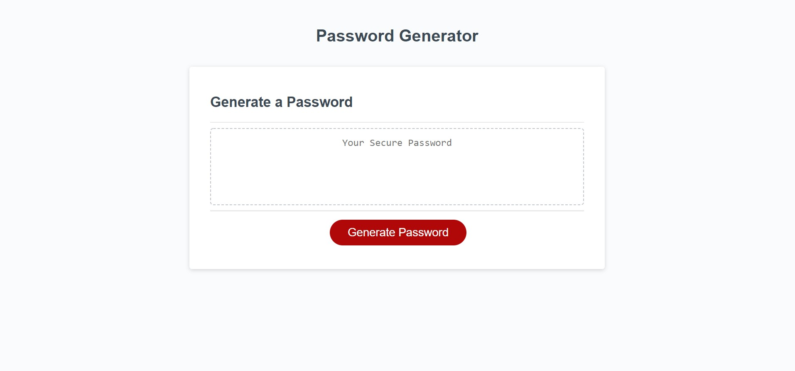
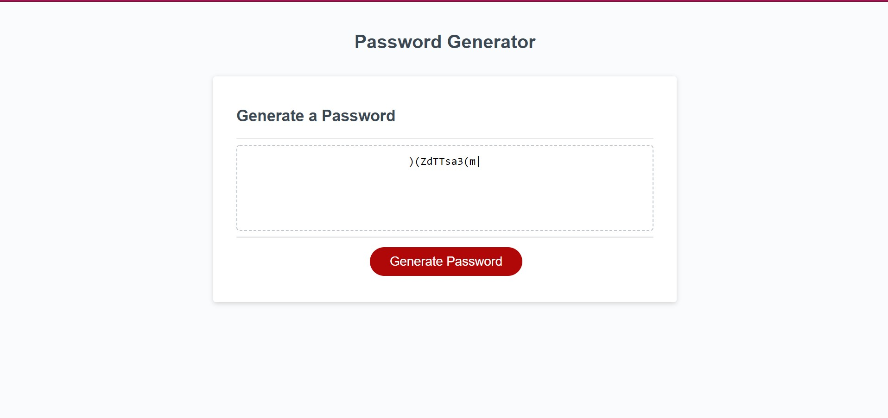

# 03 JavaScript: Password Generator Lydia Williamson

This application enables employees to generate random passwords based on criteria that they’ve selected (number of characters, lowercase letters, uppercase letters, numbers and special characters). This app will run in the browser and will feature dynamically updated HTML and CSS powered by JavaScript code. 

Link to Repo: https://github.com/lydiawdesign/Password_Generator_LW
Link to Live Site: https://lydiawdesign.github.io/Password_Generator_LW/

## User Story

```
AS AN employee with access to sensitive data
I WANT to randomly generate a password that meets certain criteria
SO THAT I can create a strong password that provides greater security
```

## Acceptance Criteria

```
GIVEN I need a new, secure password

WHEN I click the button to generate a password
THEN I am presented with a series of prompts for password criteria
- created a function that will allow the prompts to run when the generate button is selected (used addEventListener on click)

WHEN prompted for password criteria
THEN I select which criteria to include in the password
- I used a prompt and confirm in order to get the information on the criteria of the password that the user wants generated (function getPrompts ())

WHEN prompted for the length of the password
THEN I choose a length of at least 8 characters and no more than 128 characters
- I used a prompt and then validated that the answer to the prompt is a number betweeen 8 and 128 using an if statement- line 29

WHEN asked for character types to include in the password
THEN I confirm whether or not to include lowercase, uppercase, numeric, and/or special characters
- I used confirm to alert the user whether or not they would like to include these things listed above- lines 37-54

WHEN I answer each prompt
THEN my input should be validated and at least one character type should be selected
- I created a for loop to pick from the array that was created based on their answers to the prompts/confirms listed above- line 65

WHEN all prompts are answered
THEN a password is generated that matches the selected criteria
- everything comes together in the writePassword function. 

WHEN the password is generated
THEN the password is either displayed in an alert or written to the page
- line 21  displays the newly generated password in the html
```
## Technologies Used: 
Html, css, javascript

## Screenshot



Copyright (c) 2021 Lydia Williamson

Contact: lydiawdesign@gmail.com

